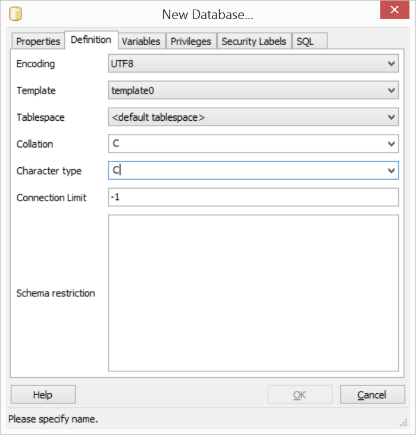

#Installing Database
Setting up MixERP database is the first task you need to perform before you
start actual development. MixERP uses one of the most advanced and open source
database engines--PostgreSQL.

PostgreSQL is a free database engine, supports almost all popular operating 
systems. This makes us (MixERP community) less tied to just one particular OS 
platform. PostgreSQL is reliable, powerful, modern, and developer-friendly 
database and has one of the most resourceful and highly regarded 
open source communities ever.

Choosing PostgreSQL was a very conscious and spontaneous decision we made
when we started development. PostgreSQL has a very liberal license, which
gives us freedom over a commercial DB engine. Likewise, in the long run,
as your data grows bigger, you will never have to worry about the license fees
and associated costs of upgrade and ownership. No one owns PostgreSQL!

Similarly, there are numerous companies providing commercial PostgreSQL support 
and consultancy if you need paid support and advise. You can always find 
another company to support you if you are not happy with the existing one,
without having to changing your database server.

##Install PostgreSQL Server First
You will need to install PostgreSQL Server, 9.3 or higher. Get the latest PostgreSQL server installer here:

[http://www.postgresql.org/download/](http://www.postgresql.org/download/)

##Create a New Database
Create a new PostgreSQL database, name it anything you want. **Lowercase database 
name** is preferred **without any special character or symbol**.

###Collation

When you create your database, navigate to the tab "Definition". Make sure that you have the following settings:

**Definition**

| Definition     | Value       | 
| -------------- | ------------| 
| Encoding       | UTF8        |
| Template       | template0   |
| Collation      | C or POSIX  |
| Character Type | C or POSIX  |

##Install MixERP Database
* Run PgAdmin3, select the newly created database. Click Tools --> Query Tool.
* Open the file "src/FrontEnd/MixERP.Net.FrontEnd/db/beta-1/v2/mixerp-incremental-sample.sql" if you want sample data.
* If you do not want sample data, open this file instead of the above "src/FrontEnd/MixERP.Net.FrontEnd/db/beta-1/v2/mixerp-incremental-blank-db.sql".

##Related Topics
* [Part 2: Editing DB Configuration](part-2-editing-db-configuration-file.md)
* [Documentation Home](../../../index.md)